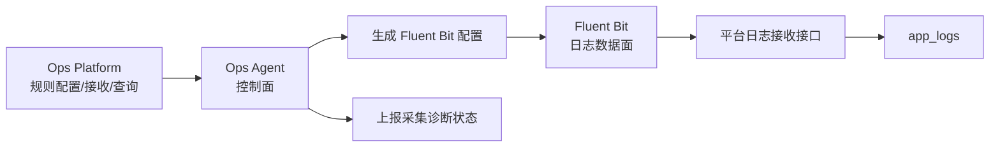

# Windows 日志采集架构试点方案

## 结论

当前先保留 Ops Agent 的控制面能力：心跳、指标、服务控制、日志规则拉取、诊断上报。日志数据面逐步切到 Fluent Bit，由 Fluent Bit 专职采集 Windows Event Log 和业务文件日志，再通过平台接收接口入库。

## 为什么这样更稳

- PowerShell Agent 适合做控制和轻量巡检，但长期 tail 文件日志会遇到编码、文件轮转、锁文件、低频日志、老系统 PowerShell 版本差异等问题。
- Fluent Bit 是成熟日志采集器，原生支持文件 tail、offset DB、Windows Event Log、批量缓冲、重试和 backpressure。
- 控制面和数据面拆开后，Agent 出问题不会直接拖垮日志采集；日志采集器升级也不需要重写整套主机纳管逻辑。

## 试点架构

## 分阶段落地

1. 短期：现有 PowerShell Agent 增加日志采集诊断状态，主机详情页可以看到路径匹配、读取行数、上传条数和错误原因。
2. 试点：选一台 Windows 测试机安装 Fluent Bit，由 Agent 生成配置，Fluent Bit 采集指定业务日志路径和 System/Application 事件日志。
3. 切换：试点稳定后，Windows 文件日志默认走 Fluent Bit；PowerShell Agent 只保留兜底采集和诊断。
4. 扩展：后续 Linux 也可以统一 Fluent Bit 数据面，Ops Agent 继续负责控制面。

## 试点前需要确认

- Fluent Bit 安装包来源：平台内置、内网文件服务器、还是手动放到测试机。
- 平台接收格式：优先复用现有 `/api/agent/hosts/:id/logs`；如 Fluent Bit HTTP 输出格式不适配，再增加专用 adapter endpoint。
- Windows 老版本兼容性：Windows Server 2008 R2 需要单独验证 Fluent Bit 版本和 VC 运行库依赖。
